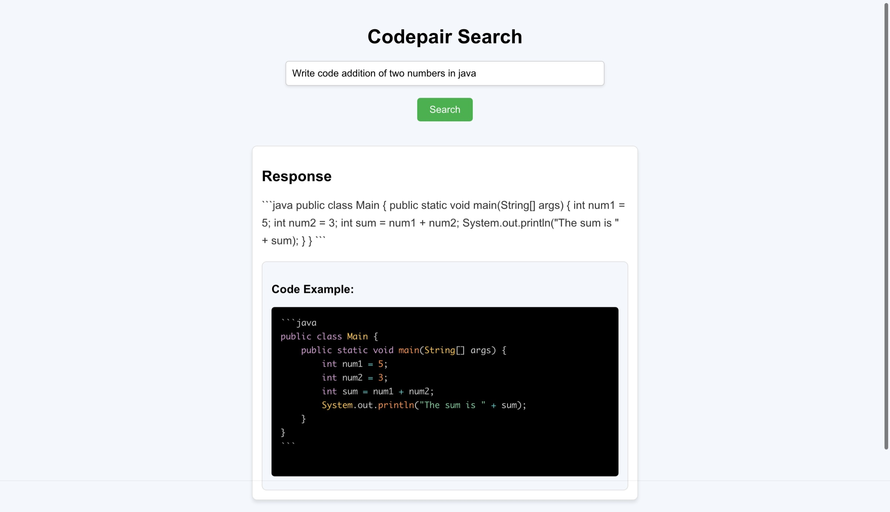

# Codepair
Excited to share my weekend project: Codepair Search utilizing DeepSeek-Coder:6.7b, a search engine designed for code generation! 💻

- Model: Driven by the DeepSeek model leveraging Ollama
- Backend: Constructed with Flask
- Frontend: Crafted using React

The model, backend & frontend hosted locally on my Mac M2 Pro 32GB Ram

#AI #MachineLearning #CodeGeneration #DeepSeek #Flask #React #WeekendProject #Python

## Screenshots

## Codepair Demo Video

  

